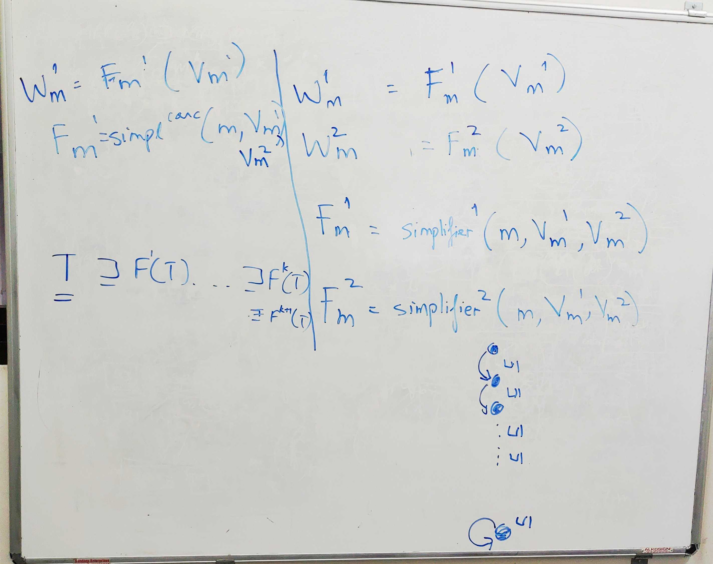
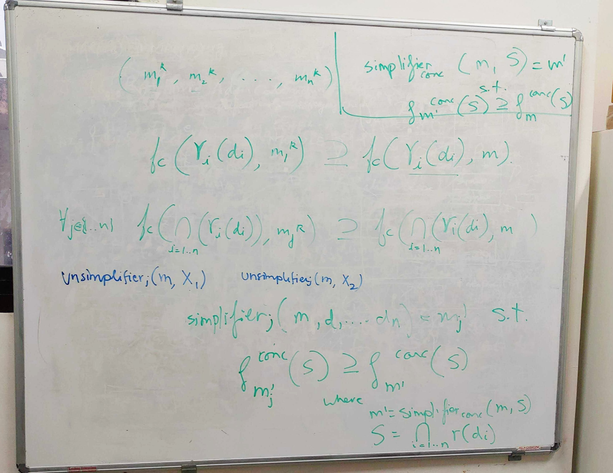
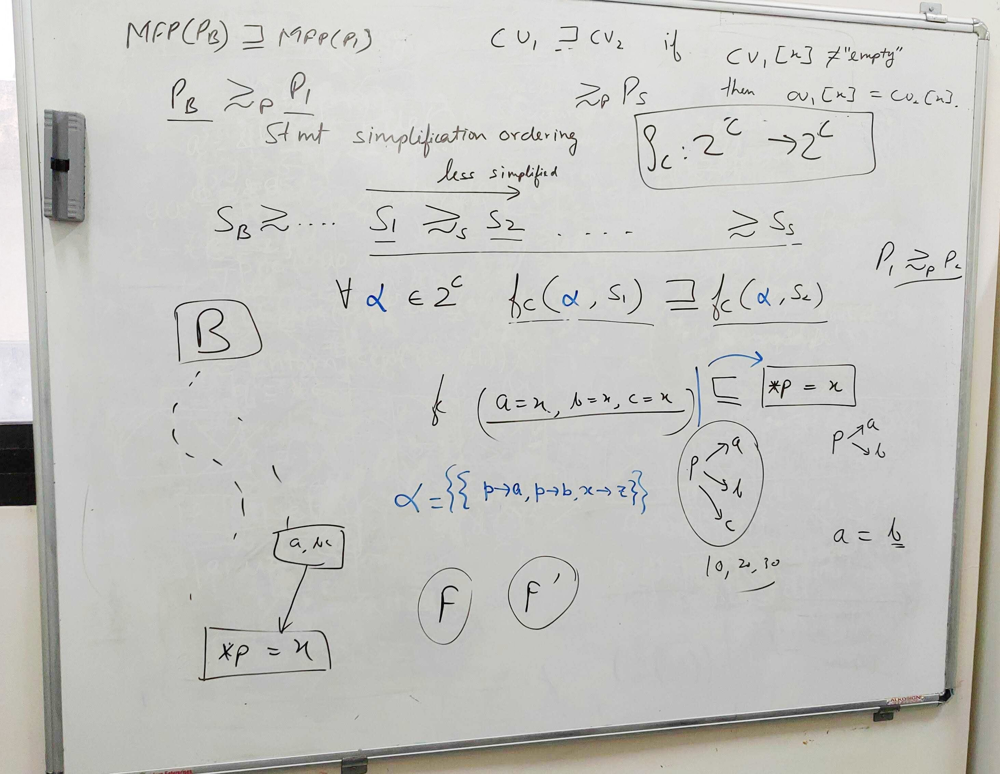
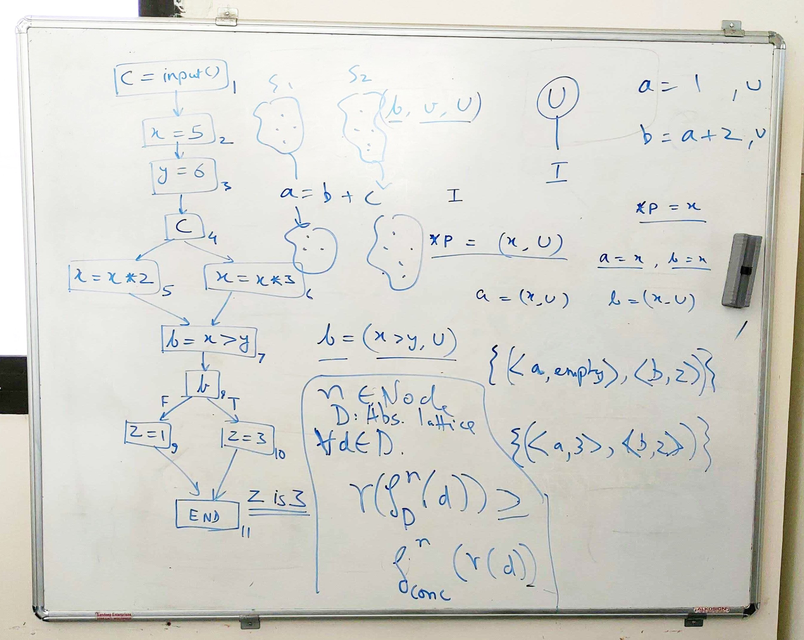
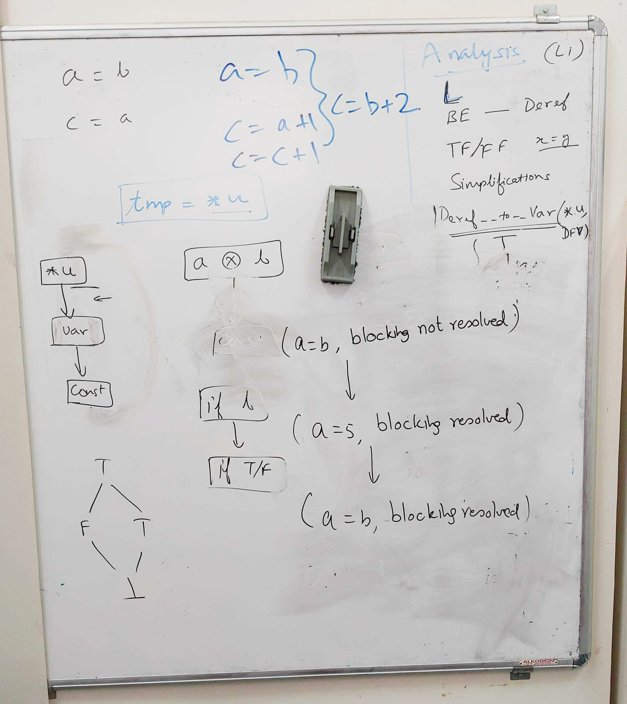
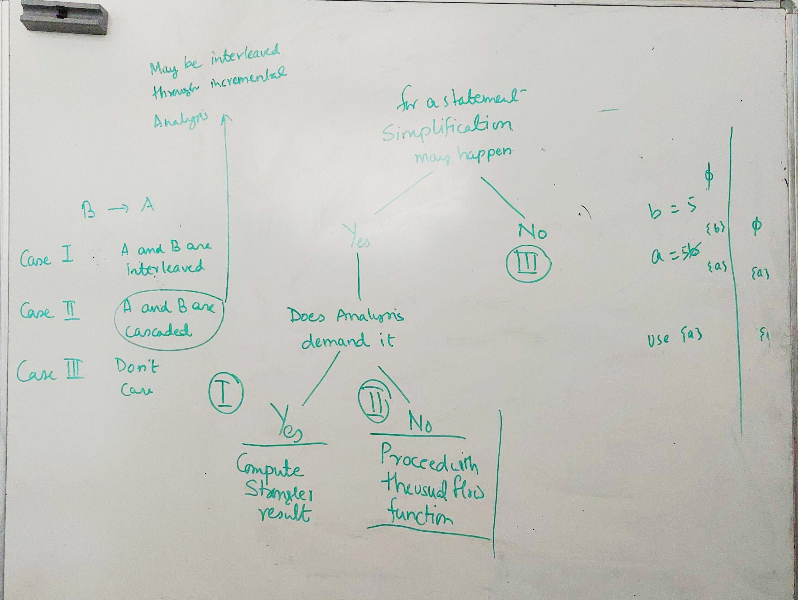
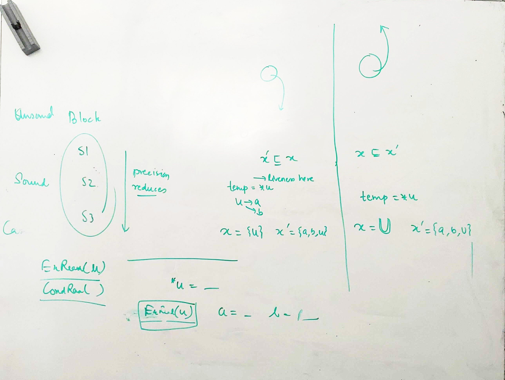
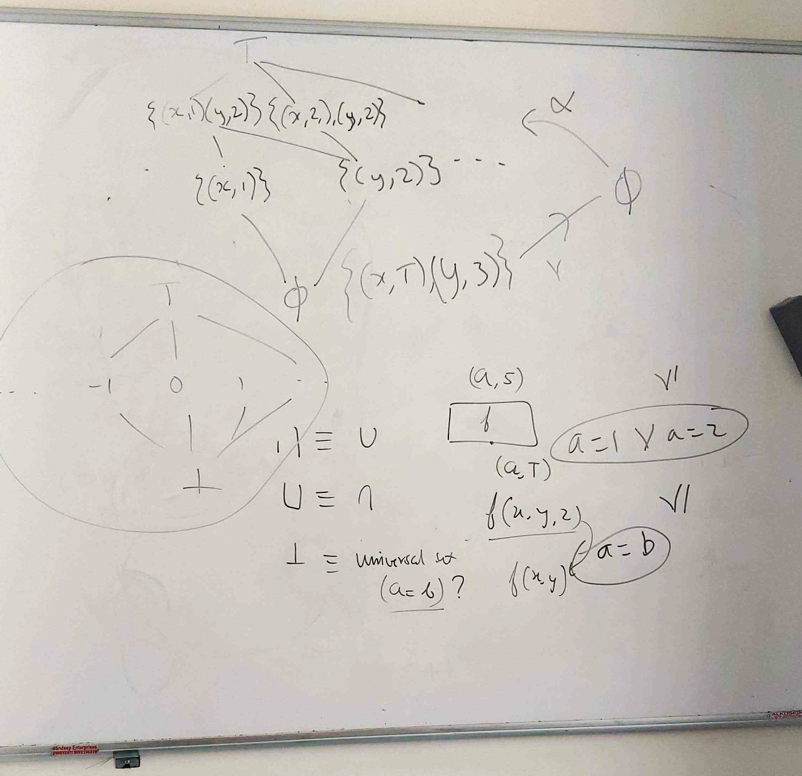

Research Meetings
===========================

Index
---------------
* [`Current Outline`](#current-outline)
* [`Meeting Mon 2019-06-17`](#20190617)
* [`Meeting Fri 2019-06-14`](#20190614)
* [`Meeting Tue 2019-06-11`](#20190611)
* [`Meeting Thu 2019-06-06`](#20190606)
* [`Other Meetings`](#othermeetings)

Meeting Mon 2019-06-17 
-----------------------

Meeting Fri 2019-06-14 
-----------------------

Meeting Tue 2019-06-11 
-----------------------

Meeting Thu 2019-06-06 
-----------------------

Other Meetings 
-----------------------

