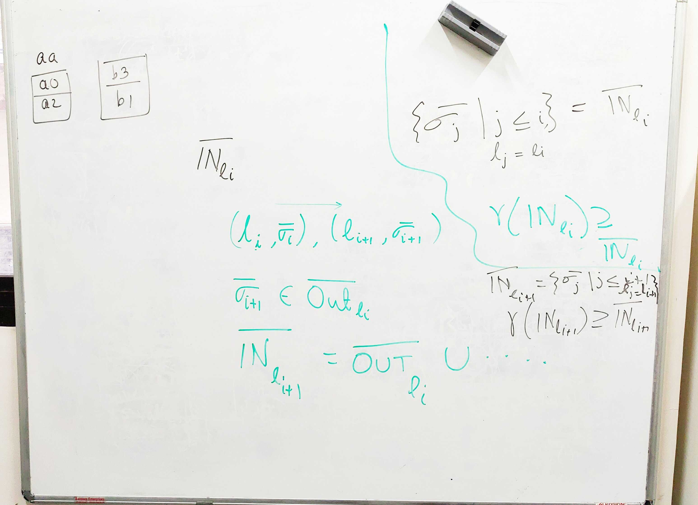
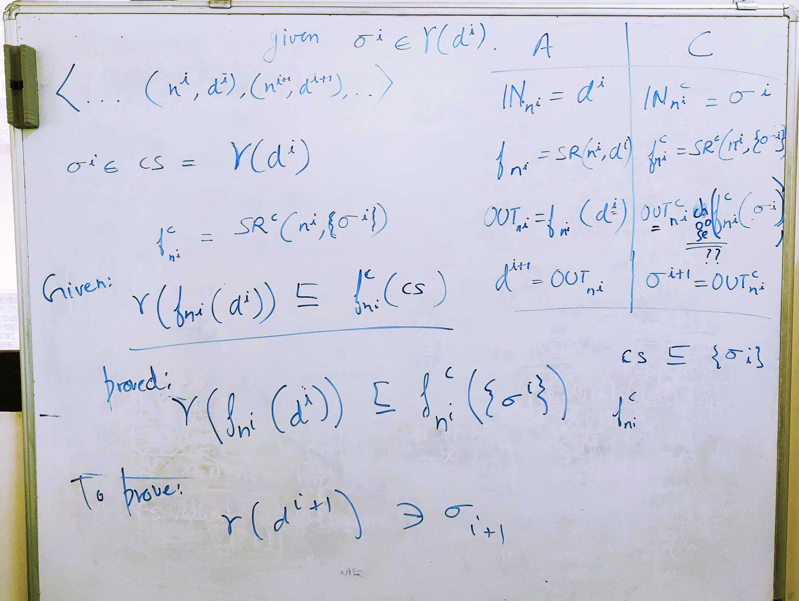

Research Meetings
===========================

Index
---------------
* [`Current Outline`](#current-outline)
* [`Meeting Mon 2019-06-24`](#20190624)
* [`Meeting Wed 2019-06-19`](#20190619)
* [`Meeting Mon 2019-06-17`](#20190617)
* [`Meeting Fri 2019-06-14`](#20190614)
* [`Meeting Tue 2019-06-11`](#20190611)
* [`Meeting Thu 2019-06-06`](#20190606)
* [`Other Meetings`](#othermeetings)

Meeting Mon 2019-06-24 
-----------------------

Meeting Wed 2019-06-19 
-----------------------

Meeting Mon 2019-06-17 
-----------------------
* Create system of equations for Abstract and Concrete domain and use the
  Kildall's reasoning to prove soundness.
* Test Kildall's reasoning on the concrete cases that we have.
* Note: we are still assuming all analyses are forward driven in lock-step manner.
  The idea is to make it working with the forward assumption and then
  add the backward component.

Meeting Fri 2019-06-14 
-----------------------
* These equations sum up the soundness requirement of the framework.
* I have neatly written it in the report.

Meeting Tue 2019-06-11 
-----------------------
* The monotonic approximation of flow function doesn't agree with
  the statement lattice we had in mind (the bottom of the lattice
  cannot be the original statement since it doesn't over-approximate
  the elements higher in the lattice). 
* We assumed for a statement `*p = x`, `a=x:b=x:c=x` is higher in the
  lattice than `*p=x`. Moreover, elements lower in the lattice
  should over-approximate
  the ones above. However, this doesn't hold in the concrete domain.
  In the concrete domain `a=x:b=x:c=x` may over-approximate `*p=x` if
  `p` in reality only points to `a` and `b` at runtime.
* Hence *simplification* lattice should be guided by the over-approximation
  criteria and not the *syntactic* criteria.

Meeting Thu 2019-06-06 
-----------------------
* This example demonstrates that a statement `b = x > y` can
  be initially blocked for one analysis but always unblocked for another.
* Available expressions could need `b = x > y` as-it-is but constant
  propagation may need a simplified version of the statement, which
  can be provided by range analysis in this case.

Other Meetings 
-----------------------

