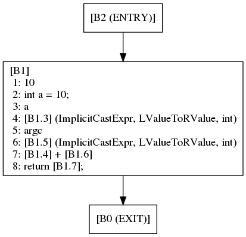

Phases of Clang/LLVM Compiler
====================
(Clang/LLVM version 9.0.0)

The phases of compilers and how to view them using Clang/LLVM.
We assume C++ source files are being compiled (hence the `.cc` extension).

This page gives a broad outline of the phases.
More details are covered in separate pages which are linked here
as soon as they are created.

The Clang/LLVM compiler has the following phases,
0. Lexical Analysis
1. Pre-processing
2. Lexical Analysis
3. Parsing & AST Generation
4. AST Analysis and Transformation (A&T)
5. Intermediate Representation (IR) Generation (LLVM IR)
6. IR A&T
7. IR Lowering & A&T      (SelectionDAG,...)
8. Machine Code Representation & A&T (MLIR)
9. Assembly/Object code generation

A&T may involve hundreds of phases of analysis followed by transformation.

## A practical look at the phase outputs
Input program `test.cc`,

    // test.cc
    #define VAL 10
    int main(int argc, char** argv) {
      int a = VAL;
      return a+argc;
    }

### Compiling the program to create an executable.
Compile a single file that contains the `main()` function.

    clang++ test.cc

This generates an `a.out` file which can be executed as `./a.out`.

    clang++ test.cc -o test

This generates the executable `test` instead of `a.out`.

### Lexing (1)

Compiling a C/C++ file with a non-standard extension,

    clang++ -x c++ -E test.txt        # treats test.txt as test.cc file
    # or
    clang   -x c   -E test.txt        # treats test.txt as test.c  file

`-E` has been included above to only go till the pre-processor stage.

### Pre-Processing ([more](pre_processing.html))
Generate the pre-processed output by executing the macro 'instructions'.
Use `-E` as follows,

    clang++ -E test.cc |& cat

Output:

    # 1 "test.cc"
    # 1 "<built-in>" 1
    # 1 "<built-in>" 3
    # 382 "<built-in>" 3
    # 1 "<command line>" 1
    # 1 "<built-in>" 2
    # 1 "test.cc" 2

    int main(int argc, char** argv) {
      int a = 10;
      return a+argc;
    }

Lines of the form,

    # linenum filename flags`

Are called *linemarkers*. *linenum* is the line number the following line is
in the *filename*. *flags* can be one or more of,
1. `1' This indicates the start of a new file.
2. `2' This indicates returning to a file (after having included another file).
3. `3' This indicates that the following text comes from a system header file, so certain warnings should be suppressed.
4. `4' This indicates that the following text should be treated as being wrapped in an implicit extern "C" block. 

Reference: <https://gcc.gnu.org/onlinedocs/gcc-3.4.6/cpp/Preprocessor-Output.html>

### Lexer ([more](lexer.html))
Dump lexical tokens of the program,

    clang -fsyntax-only -Xclang -dump-tokens test.cc

See [lexer.html](lexer.html) for details.

### View the Abstract Syntax Tree (AST)

    clang++ -fsyntax-only -Xclang -ast-dump test.cc

Output:

    TranslationUnitDecl 0x55d5ac0863f8 <<invalid sloc>> <invalid sloc>
    |-TypedefDecl 0x55d5ac086cd0 <<invalid sloc>> <invalid sloc> implicit __int128_t '__int128'
    | `-BuiltinType 0x55d5ac086990 '__int128'
    |-TypedefDecl 0x55d5ac086d40 <<invalid sloc>> <invalid sloc> implicit __uint128_t 'unsigned __int128'
    | `-BuiltinType 0x55d5ac0869b0 'unsigned __int128'
    |-TypedefDecl 0x55d5ac0870a8 <<invalid sloc>> <invalid sloc> implicit __NSConstantString '__NSConstantString_tag'
    | `-RecordType 0x55d5ac086e30 '__NSConstantString_tag'
    |   `-CXXRecord 0x55d5ac086d98 '__NSConstantString_tag'
    |-TypedefDecl 0x55d5ac087140 <<invalid sloc>> <invalid sloc> implicit __builtin_ms_va_list 'char *'
    | `-PointerType 0x55d5ac087100 'char *'
    |   `-BuiltinType 0x55d5ac086490 'char'
    |-TypedefDecl 0x55d5ac0c2878 <<invalid sloc>> <invalid sloc> implicit __builtin_va_list '__va_list_tag [1]'
    | `-ConstantArrayType 0x55d5ac0c2820 '__va_list_tag [1]' 1 
    |   `-RecordType 0x55d5ac087230 '__va_list_tag'
    |     `-CXXRecord 0x55d5ac087198 '__va_list_tag'
    `-FunctionDecl 0x55d5ac0c2a70 <test.cc:3:1, line:6:1> line:3:5 main 'int (int, char **)'
      |-ParmVarDecl 0x55d5ac0c28e8 <col:10, col:14> col:14 used argc 'int'
      |-ParmVarDecl 0x55d5ac0c2990 <col:20, col:27> col:27 argv 'char **'
      `-CompoundStmt 0x55d5ac0c2cc0 <col:33, line:6:1>
        |-DeclStmt 0x55d5ac0c2c08 <line:4:3, col:14>
        | `-VarDecl 0x55d5ac0c2b80 <col:3, line:2:13> line:4:7 used a 'int' cinit
        |   `-IntegerLiteral 0x55d5ac0c2be8 <line:2:13> 'int' 10
        `-ReturnStmt 0x55d5ac0c2cb0 <line:5:3, col:12>
          `-BinaryOperator 0x55d5ac0c2c90 <col:10, col:12> 'int' '+'
            |-ImplicitCastExpr 0x55d5ac0c2c60 <col:10> 'int' <LValueToRValue>
            | `-DeclRefExpr 0x55d5ac0c2c20 <col:10> 'int' lvalue Var 0x55d5ac0c2b80 'a' 'int'
            `-ImplicitCastExpr 0x55d5ac0c2c78 <col:12> 'int' <LValueToRValue>
              `-DeclRefExpr 0x55d5ac0c2c40 <col:12> 'int' lvalue ParmVar 0x55d5ac0c28e8 'argc' 'int'

Without the `-fsyntax-only` argument the following error follows the AST dump,

    /tmp/test-566717.o: file not recognized: File truncated
    clang-9: error: linker command failed with exit code 1 (use -v to see invocation)

To view AST broken into basic blocks, do the following

    clang++ --analyze -Xanalyzer -analyzer-checker=debug.ViewCFG test.cc

Output:

### View the generated IR (LLVM IR)

    clang++ -emit-llvm -S test.c -o test.ll

`test.ll` is:

    ; ModuleID = 'test.cc'
    source_filename = "test.cc"
    target datalayout = "e-m:e-i64:64-f80:128-n8:16:32:64-S128"
    target triple = "x86_64-unknown-linux-gnu"
    
    ; Function Attrs: noinline norecurse nounwind optnone uwtable
    define dso_local i32 @main(i32 %argc, i8** %argv) #0 {
    entry:
      %retval = alloca i32, align 4
      %argc.addr = alloca i32, align 4
      %argv.addr = alloca i8**, align 8
      %a = alloca i32, align 4
      store i32 0, i32* %retval, align 4
      store i32 %argc, i32* %argc.addr, align 4
      store i8** %argv, i8*** %argv.addr, align 8
      store i32 10, i32* %a, align 4
      %0 = load i32, i32* %a, align 4
      %1 = load i32, i32* %argc.addr, align 4
      %add = add nsw i32 %0, %1
      ret i32 %add
    }
    
    attributes #0 = { noinline norecurse nounwind optnone uwtable "correctly-rounded-divide-sqrt-fp-math"="false" "disable-tail-calls"="false" "less-precise-fpmad"="false" "min-legal-vector-width"="0" "no-frame-pointer-elim"="true" "no-frame-pointer-elim-non-leaf" "no-infs-fp-math"="false" "no-jump-tables"="false" "no-nans-fp-math"="false" "no-signed-zeros-fp-math"="false" "no-trapping-math"="false" "stack-protector-buffer-size"="8" "target-cpu"="x86-64" "target-features"="+cx8,+fxsr,+mmx,+sse,+sse2,+x87" "unsafe-fp-math"="false" "use-soft-float"="false" }
    
    !llvm.module.flags = !{!0}
    !llvm.ident = !{!1}
    
    !0 = !{i32 1, !"wchar_size", i32 4}
    !1 = !{!"clang version 9.0.0 (tags/RELEASE_900/final)"}

Without option `-S` LLVM bitcode file (`.bc`) is generated.
Conventionally its file extension is `.bc`.

#### Converting between `.bc` and `.ll` files

1. `llvm-as  test.ll`  generates `test.bc` file.
1. `llvm-dis test.bc`  generates `test.ll` file.

### Run an optimizer on the LLVM IR

The `opt` tool is used to explicitly control the analysis and optimization
passes run in LLVM.

    opt ...

### Generate assemply output

    clang++ -S test.cc

It generates the following `test.s` file,

    	.text
    	.file	"test.cc"
    	.globl	main                    # -- Begin function main
    	.p2align	4, 0x90
    	.type	main,@function
    main:                                   # @main
    	.cfi_startproc
    # %bb.0:                                # %entry
    	pushq	%rbp
    	.cfi_def_cfa_offset 16
    	.cfi_offset %rbp, -16
    	movq	%rsp, %rbp
    	.cfi_def_cfa_register %rbp
    	movl	$0, -4(%rbp)
    	movl	%edi, -8(%rbp)
    	movq	%rsi, -16(%rbp)
    	movl	$10, -20(%rbp)
    	movl	-20(%rbp), %eax
    	addl	-8(%rbp), %eax
    	popq	%rbp
    	.cfi_def_cfa %rsp, 8
    	retq
    .Lfunc_end0:
    	.size	main, .Lfunc_end0-main
    	.cfi_endproc
                                            # -- End function
    
    	.ident	"clang version 9.0.0 (tags/RELEASE_900/final)"
    	.section	".note.GNU-stack","",@progbits
    	.addrsig

To get more detailed output of which LLVM's machine instruction
resulted in the assembly instructions (`--asm-show-inst`)
with minor comments here and there, use the following two step process,

    clang++ -S -emit-llvm test.cc -o test.ll;
    llc --asm-verbose --asm-show-inst test.ll -o test.s; # VERBOSE ASM (not very useful)

### Object file output

From different input types,
1. `clang++ -c test.cc`
1. `clang++ -c test.s`

This generates `test.o` file which is not linked, and hence not ready
for execution.

### Executable file

    clang++ test.o

Links `test.o` and generates the `a.out` executable file.

    clang++ test.s

Assembles `test.s`, links the generated object file,
and generates the `a.out` executable file.

## References
1. [Clang command line reference][1]

[1]: https://clang.llvm.org/docs/ClangCommandLineReference.html

